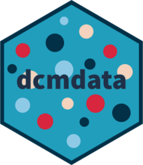

<!-- README.md is generated from README.Rmd. Please edit that file -->

```{r, include = FALSE}
knitr::opts_chunk$set(
  collapse = TRUE,
  comment = "#>",
  fig.path = "man/figures/README-",
  out.width = "100%"
)
```

# dcmdata <a href="https://dcmdata.r-dcm.org"></a>

<!-- badges: start -->
[](https://www.repostatus.org/#active)
[](https://lifecycle.r-lib.org/articles/stages.html)
[](https://cran.r-project.org/package=dcmdata)
[](https://cran.r-project.org/package=dcmdata)</br>
[](https://github.com/r-dcm/dcmdata/actions/workflows/R-CMD-check.yaml)
[](https://app.codecov.io/gh/r-dcm/dcmdata?branch=main)
[](https://github.com/r-dcm/dcmdata/actions/workflows/pkgdown.yaml)</br>
[](https://keybase.io/wjakethompson)

<!-- badges: end -->

The goal of dcmdata is to provide easy access to data sets for use with diagnostic classification models.


## Installation

You can install the released version of dcmdata from [CRAN](https://cran.r-project.org/) with:

```r
install.packages("dcmdata")
```

And the development version from [GitHub](https://github.com/) with:

```r
# install.packages("pak")
pak::pak("r-dcm/dcmdata")
```

## About the data

dcmdata contains both real and simulated data sets for educational and psychological assessment.
For more information on each data set, see the linked reference pages.

### Real data sets

* [ECPE](https://dcmdata.r-dcm.org/reference/ecpe.html): Assessment data from the Examination for the Certificate of Proficiency in English, as described in [Templin and Hoffman (2013)](https://doi.org/10.1111/emip.12010).
* [Fraction](https://dcmdata.r-dcm.org/reference/fraction.html): The fraction subtraction data described by [Tatsuoka (2002)](https://doi.org/10.1111/1467-9876.00272).
* [MCMI](https://dcmdata.r-dcm.org/reference/mcmi.html): Psychological assessment data from the Millon Clinical Multiaxial Inventory-III, as described in [Rossi et al. (2010)](https://doi.org/10.1521/pedi.2010.24.1.128).
* [MDM](https://dcmdata.r-dcm.org/reference/mdm.html): A short integer multiplication assessment, as described in [MacReady and Dayton (1977)](https://doi.org/10.2307/1164802).
* [PIE](https://dcmdata.r-dcm.org/reference/pie.html): Assessment data from the Pathways for Instructionally Embedded Assessment data, as described by [ATLAS (2025)](https://pie.atlas4learning.org/sites/default/files/documents/resources/PIE_Pilot_Study_Design_and_Administration_Evidence.pdf).
* [ROAR-PA](https://dcmdata.r-dcm.org/reference/roarpa.html): Data from the Rapid Online Assessment of Reading and Phonological Awareness, as described by [Gijbels et al. (2024)](https://doi.org/10.1038/s41598-024-60834-9).
* [TIMSS-03](https://dcmdata.r-dcm.org/reference/timss03.html): Data from the 2003 grade 8 Trends in International Mathematics and Science Study, as describe by [Skaggs et al. (2016)](https://doi.org/10.1080/15305058.2016.1145683).
* [TIMSS-07](https://dcmdata.r-dcm.org/reference/timss07.html): Data from the 2007 grade 4 Trends in International Mathematics and Science Study, as describe by [Park et al. (2011)](https://doi.org/10.1080/15305058.2010.534571).


### Simulated data sets

* [DTMR](https://dcmdata.r-dcm.org/reference/dtmr.html): A data set based on the Diagnostic Teachers' Multiplicative Reasoning assessment, described in [Bradshaw et al. (2014)](https://doi.org/10.1111/emip.12020).

---

## Contributions and Code of Conduct

Contributions are welcome.
To ensure a smooth process, please review the [Contributing Guide](https://dcmdata.r-dcm.org/CONTRIBUTING.html).
Please note that the dcmdata project is released with a [Contributor Code of Conduct](https://dcmdata.r-dcm.org/CODE_OF_CONDUCT.html).
By contributing to this project, you agree to abide by its terms.
