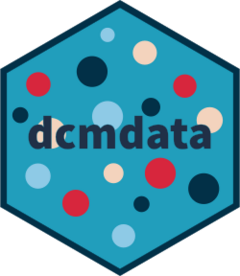

<!-- README.md is generated from README.Rmd. Please edit that file -->

# dcmdata <a href="https://dcmdata.r-dcm.org"></a>

<!-- badges: start -->

[](https://www.repostatus.org/#active)
[](https://lifecycle.r-lib.org/articles/stages.html)
[](https://cran.r-project.org/package=measr)
[](https://cran.r-project.org/package=measr)</br>
[](https://github.com/r-dcm/dcmdata/actions/workflows/R-CMD-check.yaml)
[](https://app.codecov.io/gh/r-dcm/dcmdata?branch=main)
[](https://github.com/r-dcm/dcmdata/actions/workflows/pkgdown.yaml)</br>
[](https://keybase.io/wjakethompson)

<!-- badges: end -->

The goal of dcmdata is to provide easy access to data sets for use with
diagnostic classification models.

## Installation

You can install the development version of dcmdata from
[GitHub](https://github.com/) with:

``` r
# install.packages("pak")
pak::pak("r-dcm/dcmdata")
```

## About the data

dcmdata contains both real and simulated data sets for educational and
psychological assessment. For more information on each data set, see the
linked reference pages.

### Real data sets

- [ECPE](reference/ecpe.html): Assessment data from the Examination for
  the Certificate of Proficiency in English, as described in [Templin
  and Hoffman (2013)](https://doi.org/10.1111/emip.12010).
- [MDM](reference/mdm.html): A short integer multiplication assessment,
  as described in [MacReady and Dayton
  (1977)](https://doi.org/10.2307/1164802).

### Simulated data sets

- [DTMR](reference/dtmr.html): A data set based on the Diagnostic
  Teachers’ Multiplicative Reasoning assessment, described in [Bradshaw
  et al. (2014)](https://doi.org/10.1111/emip.12020).

------------------------------------------------------------------------

## Contributions and Code of Conduct

Contributions are welcome. To ensure a smooth process, please review the
[Contributing Guide](https://dcmdata.r-dcm.org/CONTRIBUTING.html).
Please note that the dcmdata project is released with a [Contributor
Code of Conduct](https://dcmdata.r-dcm.org/CODE_OF_CONDUCT.html). By
contributing to this project, you agree to abide by its terms.
